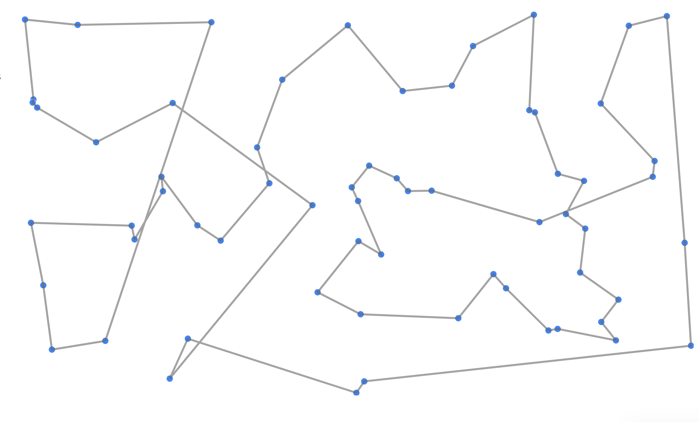
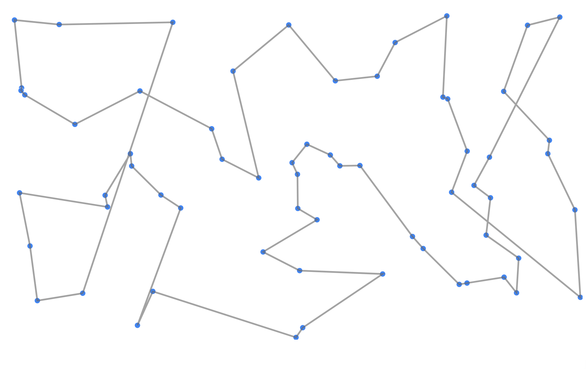
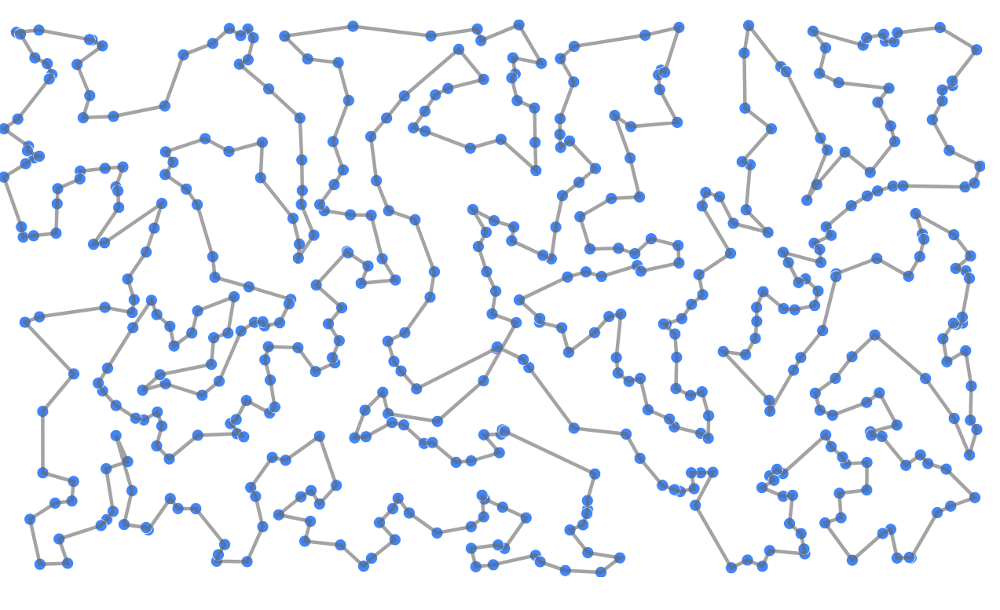

# 5週目　
## 現状の観察
### 値
| best score | 3,291.62	| 3,778.72	| 4,494.42	| 8,233.56	| 10,635.22	| 21,191.89	| 42,187.11
| ----	| ----	| ----	| ----	| ----	| ----	| ---- | ---- |
| greedy | 3,418.10  |  3,832.29 | 5,449.44 | 10,519.16 | 12,684.06 | 25,331.84 | 49,892.05 |
| sa  | 3,291.62  |  3,778.72 | 4,494.42 | 8,150.91 | 10,675.29 | 21,119.55 | 44,393.89 |
- greedy は　best scoreとオーダーはおなじで，一桁目は一緒
- -> 今回のデータセットに対しては，greedyを改変することで，best scoreに近づけることができそう！
### 図

- 交差がある
    -  -> 交差をなくせばよい
    - -> 交差を見つけて，swapすればいい
    - 交差をみつける
        - ふわっと）線を新たに引くとき，今までのものに交わっていたら，
        - 実装）今までのエッジを保持しておいて，greedy法により，AからBへ線をあらたに引こうとするとき，線分ABと交わるエッジが今までのエッジの中にあるかどうか調べる。（複数あるかもしれない）
    - swapする
        - ふわっと）対角線がきまっている台形の，向かい合う二辺は二組あるが，一方を選ぶと島が途切れてしまう場合があるのが避けたいこと。
        - 実装）線分A->Bを引くとき，もとのエッジC->Dに被ってしまったとする。...C,D.....A,Bのかわりに，...C,A....D,Bとするのに加えて，AとDの間におとずれていたエッジをひっくり返す必要がある。そして，エッジの集合を更新する。交差が複数生じた場合は，そもそも厳密解ではなくヒューリスティックなので初めに見つけた方を選んでも良いし，もしくは，交差がなくなるまで，swapを続けても良い
- 帰りが長い
    - 反対向きに辿って重ね合わせる？

## 行ったこと
1.  貪欲法を用いて経路を探す。あたらしいノードをpathに加える際，今までのエッジEi(node_s,node_e)を見ていき，
distance(node_s,node_e)+distance(あたらしいエッジ)と，
distance(node_s,一つ前のノード)+distance(node_e,あたらしいノード)を比較して，
後者の方が短ければ経路を繋ぎ変える。

※実装上，完全に交差をなくしているわけではない。順に見て，交差を解消したほうが改善されるときのみ解消している。

2.  焼き鈍し法
ある経路に対し，エッジを取り替える変更を行ったもののなかで，経路が短いものkこをk近傍と呼ぶ。
そのなかからランダムに経路を選び，以前と改善されていれば変更，以前より改悪でも一定の割合で採用する。

# ６週目
以下は時系列順に、試したことの結果の値をまとめたものである。
試したことは順に表の下に記されている。

| method | challenge0 | challenge1 | challenge2 | challenge3 | challenge4 | challenge5 | challenge6 | challenge7 |
| --- | --- | --- | --- | --- | --- | --- | --- | --- |
| greedy | 3418.10 | 3832.29 | 5449.44 | 10519.16 | 12684.06 | 25331.84 | 49892.05 | 95983.29 |
| 2-opt ver1 | 3418.10 | 3832.29 | 5232.96 | 9825.02 | 11766.38 | 24084.79 | 47261.33 | --- |
| sa ver1 | 3291.62 | 3832.29 | 5232.96 | 9825.02 | 11766.38 | 22894.91  | 47261.33 | --- |
| 2-opt ver2 | 3418.10 | 3832.29 | 5011.40 |  9660.48 |  11799.59 | 23887.73 | 45484.91 | 88029.76 |
| 2-opt ver3 | 3418.10 | 3832.29 | 5011.40 | 8970.05 | 11501.40 | 21389.71 | 42712.37 | 84190.72 |
| 2-opt ver4 | 3418.10 | 3832.29 | 4494.42 | 8925.75 | 11323.84 | 21295.89 | 42660.76 | 84444.48 |
| sa ver2 | 3291.62 | 3778.72 | 4751.80 | 8626.53 | 11714.91 | 21675.62 | 46167.00 | --- |
| sa ver3 | 3291.62 | 3778.72 | 4994.89 | 8628.92 | 11094.08 | 21441.61 | 45797.68 | --- |
| sa ver4 | 3291.62 | 3778.72 | 4494.42 | 8970.18 | 11531.15 | 21788.23 | 46524.21 | --- |
| sa ver5 | 3291.62 | 3832.29 | 5023.89 | 8647.04 | 11385.39 | 21523.74 | 45668.40 | --- |
| sa ver6 | 3291.62 | 3778.72 | 4494.42 | 8680.68 | 11476.41 | 21321.37 | 45208.63 | --- |
| sa + 2-opt ver1 | 3291.62 | 3778.72 | 4494.42 | 8668.47 | 11472.46 | 21086.73 | 41888.55 | --- |
| 2-opt + sa + 2-opt | 3291.62 | 3832.29 | 4494.42 | 8676.24 | 11211.05 | 21251.11 | 42632.40 | --- |
| sa + 2-opt ver2 | 3291.62 | 3832.29 | 4494.42 | 8451.60 | 11396.81 | 21135.65 | 42570.59 | 91513.74 | 
| sa + 2-opt ver3 | 3291.62 | 3832.29 | 4494.42 | 8401.88 | 11574.94 | 21444.62 | 41983.00 | --- | 

*2-opt ver2は、貪欲法で全体の経路を求めたあとに、2-optを適用する  
*2-opt ver3は、さらに、two-optを、改善がみられなくなるまで繰り返し適用する。  
*2-opt ver4は、さらに、始点を左上にして開始する。    
なお、貪欲法により、始点が左上でも、解が改善しない場合がある。    
*sa ver2 貪欲法で、左上から始まる経路を求めた上でsaを適用する　パラメタは特に調整をしていない。  
*sa ver3 貪欲法で、左上から始まる経路を求めた上でsaを適用する　初期温度を変える。(初期温度を高くする100度)  
*sa ver4 貪欲法で、左上から始まる経路を求めた上でsaを適用する　初期温度を変える。(初期温度を25度、冷却0.8,閾値0.2度、k 10)にした。  
2-opt ver4よりも良い値もでるが、Nが大きくなると見つからなくなる=>単純に、試行が足りていないものと思われる。  
*sa ver5 貪欲法で、左上から始まる経路を求めた上でsaを適用する　冷却を緩やかにする。(初期温度を25度、冷却0.9,閾値0.2度、k 10)にした。  
Nが大きいと、ver3よりもよりよい値が出ているが、初期温度100度のときに及ばないので、初期温度を上げてみる。  
*sa ver6 貪欲法で、左上から始まる経路を求めた上でsaを適用する　冷却を緩やかにする。(初期温度を80度、冷却0.9,閾値0.2度、k 8)にした。  

*sa+two opt ver1は saとtwo optを付け加えたものである。

*two opt + sa + two optで実装すると、おそらく、局所解にはまらないというsaの良さを殺してしまうのだろう。  

*sa+two opt ver2は , challenge7が動くように、ランダムに探索範囲を制限していることが、ver1との違いである。

*sa+two opt ver3は sa + two opt ver1 の初期温度パラメタをあげて、最k近傍のkを減らした。

## 試す推移

直線が残る部分に関する対策としては、
- 2-optを繰り返す
- 領域を分割する
- 初期の値をかえる
- 焼き鈍し法を使う
等が考えられる。

## 2-optを繰り返し適用する。
値が改善しなくなるまで、2-optの適用を繰り返した。
| 2-opt iteration | challenge0 | challenge1 | challenge2 | challenge3 | challenge4 | challenge5 | challenge6 | challenge7 |
| --- | --- | --- | --- | --- | --- | --- | --- | --- |
| count | 1 | 1 | 2 | 3 | 4 | 7 | 6 | 8 |

## スタート地点を端っこにする。
スタート地点として、左上の市を選択し、そこから貪欲法でルートを求め、あとは同様に2-optを適用した。

このように斜めに伸びてしまうことが観察された。密な配置なので大きな問題ではないかもしれない。
斜めに伸びるのを解消するには、領域に区切るのもありかもしれない。

## 局所解にいよいよ陥ってきたので、saを用いる。
また、challenge7のように、頂点数が多い場合は、saにおける最k近傍の探索範囲をランダムに限定している。

# 最終結果
Challenge 6の最小経路の長さは、41888.55　であり、saのあとに、2-optを適用して求められたものである。
Challenge 7の最小経路の長さは、84190.72　であり、これは、2-optを、改善がされなくなるまで適用したときに得られた。