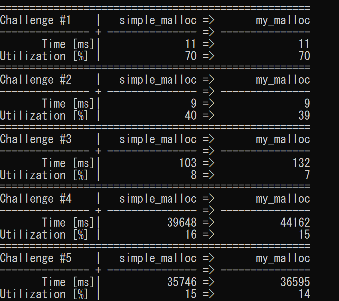
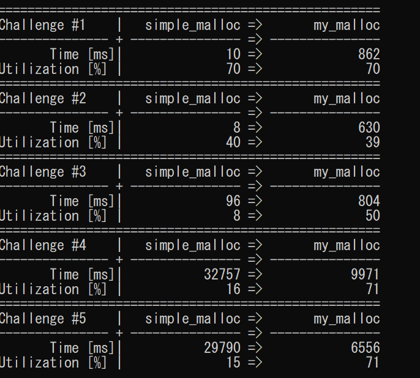
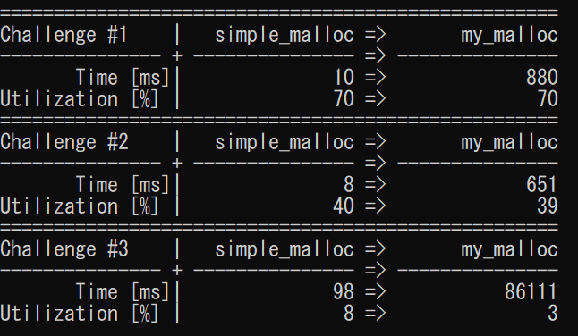
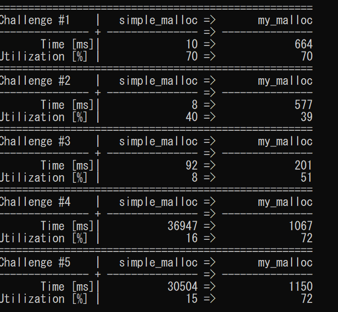

# 概要
# fit level(best fit, worst fit)
first fit
best fit
worst fit 実装
# 結果
## first fit

## best fit

- utiizationは全体的に増加している
- 時間効率は、challenge 1,2,3では変わらないか増加しているが、challenge4,5では減少している。
- 隙間が空いているので、再度mallocを回す必要がないからかもしれない。
## worst fit

# free list bin

単純なbestfitの実装より、時間効率が良い。
# 