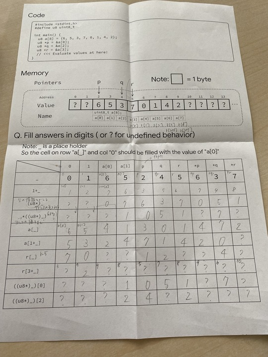
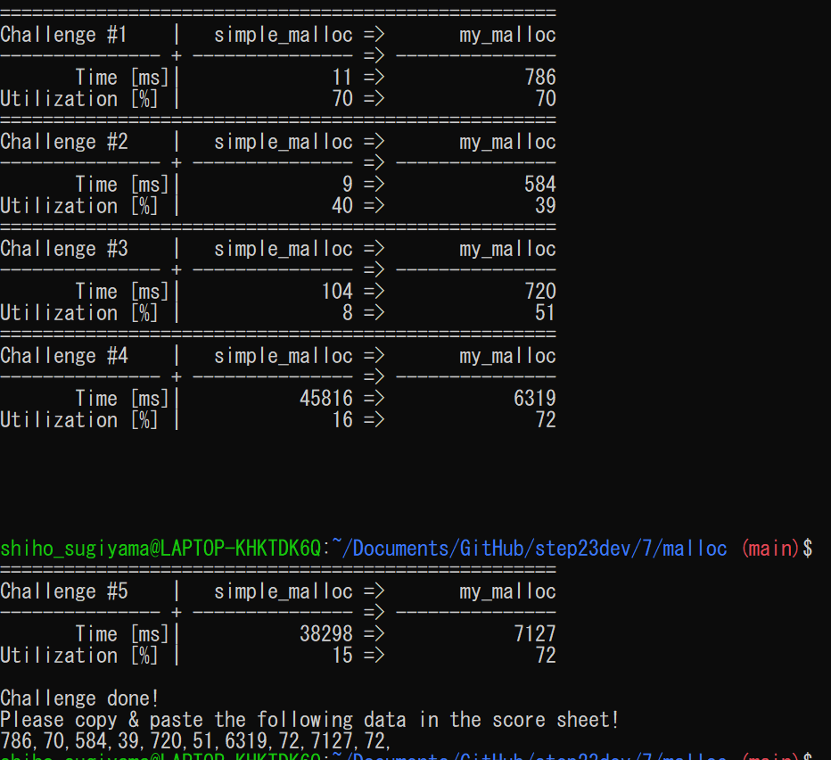
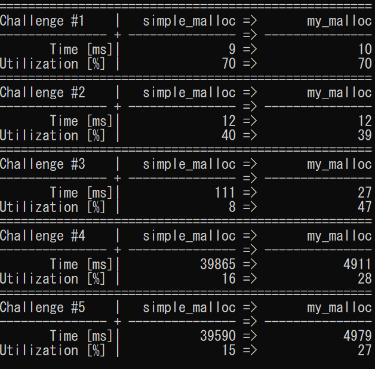

# ポインタ100ます計算

# 概要
メモリリソースをアプリケーションからの要求に応じて確保、解放する、mallocとfreeを実装する。
# 実装関数
前提として、free list binを用いるものとする。
- my_malloc  
空領域リストを走査し、要求を満たす空領域を探して確保する。空領域リストを走査する際、要求サイズに対応するビンを見て、空であれば次の大きさのビンを見ることを繰り返す。最終的に、要求を満たす空領域が入ったビンが見つからない場合は、OSから新たに4096バイトのページをもらう。
要求サイズ以上かつ要素が存在するビンを見つけたときは、以下のcustom_fitを呼び、適切な空領域を特定する。
- custom_fit  
引数kLevelの値に応じて、first_fit,best_fit,worst_fitを呼ぶ。
- first_fit  
ビンの中を順に見て、要求サイズ以上の最初の空領域を返す。
- best_fit  
ビンの中を順に見て、要求サイズ以上かつ最小の空領域を返す。
- worst_fit  
ビンの中を順に見て、要求サイズ以上かつ最大の空領域を返す。

また、デバッグ用に、リストの中身をすべて返す、my_print_free_list_binを実装した。

# 結果
## first fit without bin

## best fit without bin

- utiizationは全体的に増加している
- かかる時間は、challenge 1,2,3ではfirst binを用いた際と、変わらないか増加しているが、challenge4,5では減少している。
- first binだと、空領域が存在する場合は、早く見つかるが、そもそも、端切れが多く十分な空領域がなくなって、OSに新しいページを要求し、再度mallocを回す、という操作が時間負荷になっていると考えられる。
## worst fit without bin

- 時間がかかりすぎるので、Challenge4,5は中止した。
- best fitと同等以上の時間がかかり、first fitよりutilizationが低い。

## free list bin with bin

単純なbestfitの実装より、時間効率が良い。
上記の表に示したのは、binのサイズとして、2^4~2^12までの9このビンを用いたときの結果である。

以下は、500~4500までの9このビンを用いたときの結果であり、時間効率が悪くなっていることから、free list binを実装しても、その時間効率は、binのサイズ分けに影響されることが分かる。

ビンを用い、かつfirst fitを行ったときの結果を以下に示す。ビンを用い、かつbest fitを行ったときと比べて、challenge1,2では時間効率が良くなっているが、challenge4,5では悪くなっている。

